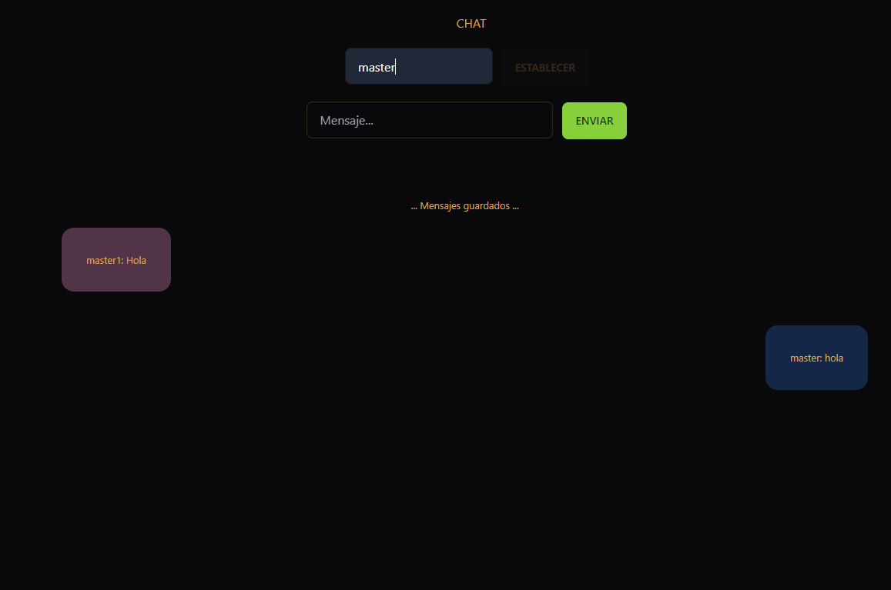

# ChatWeb TailwindCss

Solo es necesario instalar "node_modules" y empezar a usar


# Instalacion

Comandos para iniciar

```bash
  npm install
  cd chatweb
```

## License

[MIT](https://choosealicense.com/licenses/mit/)

